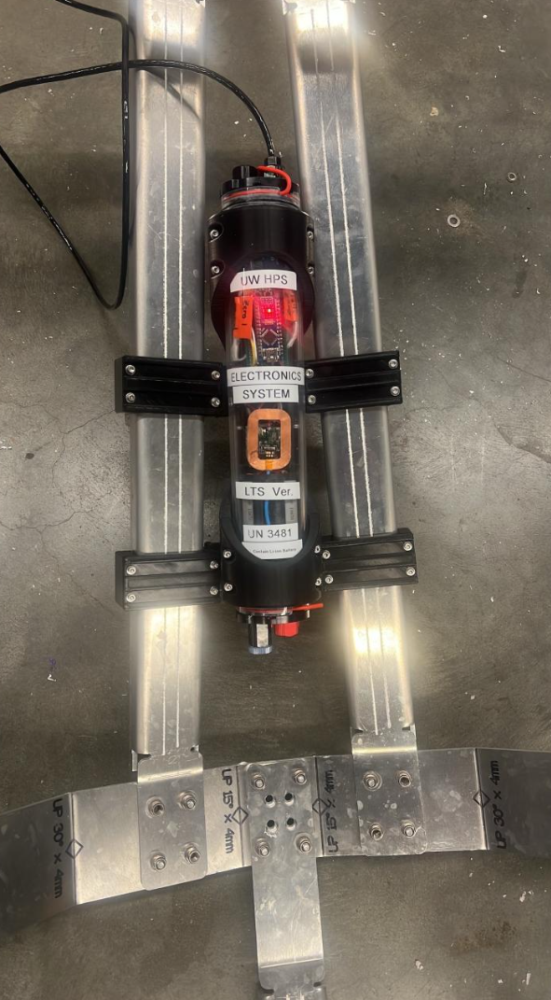
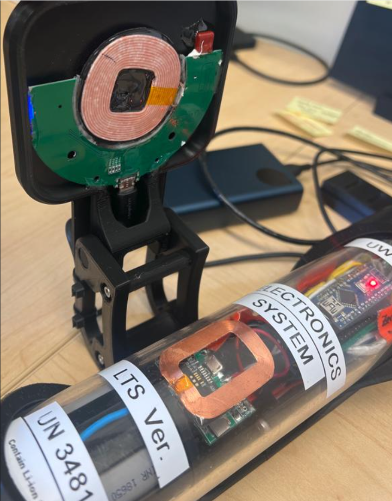

<section id="about"></section>

# <i class="fa-solid fa-address-card"></i> About

  <h4 style="margin: 0; color: #00ffcc; font-family: 'JetBrains Mono', monospace;">
    Actively seeking Summer 2026 Internships
  </h4>
  

    Focus: Embedded Systems | Hardware Engineering | Robotics
  

I am an **Electrical & Computer Engineering** student at the University of Washington specializing in end-to-end embedded systems development.

* **Hardware Design:** Schematic capture and PCB layout using **Altium** and **KiCAD**.
* **Systems Engineering:** Development of wireless power modules and low-latency communication networks.
* **Firmware & Debugging:** Bridging physical sensors with software via system-level debugging and firmware development.

---

<section id="experience"></section>

# <i class="fa-solid fa-briefcase"></i> Experience

  

    RESEARCH / EMBEDDED SYSTEMS
    JAN 2026 — PRESENT
  

  <h3 style="font-family: 'JetBrains Mono', monospace; margin-top: 0.5rem;">Programmable Matter Lab</h3>
  
Undergraduate Researcher | Seattle, WA

  
  <ul style="font-size: 0.9rem;">
    <li>Digitally modeled 9 tiles to guide physical layout and mapped hardware block placement into software using measured capacitance values.</li>
    <li>Implemented a low-latency ESP32-C3 BLE Broadcasting network for real-time computer communication.</li>
    <li>Analyzed datasheets to develop electronics system including ESP32-C3 microcontroller, FDC2214 capacitance-to-digital converters, and multiplexers.</li>
    <li>Designed a direct-drive power system utilizing 3.2V LiFePO4 batteries to maintain a stable operating range (3.0V–3.6V).</li>
    <li>Prototyped circuits on breadboards, optimizing signal routing and stabilized capacitance readings to reduce noise by 20%.</li>
  </ul>

  

    
ESP32-C3 MCU Stack

    
-20% Signal Noise

    
LiFePO4 Power

  

  

    Embedded CBLEMixed-SignalSignal Integrity
  

  

    ROBOTICS / HARDWARE DESIGN
    SEPT 2024 — PRESENT
  

  <h3 style="font-family: 'JetBrains Mono', monospace; margin-top: 0.5rem;">Husky Robotics Club</h3>
  
Electronics Engineer | Seattle, WA

  
  <ul style="font-size: 0.9rem;">
    <li>Collaborated with partner to design PCBs using Altium Designer for team's mockup Mars Rover.</li>
    <li>Designed a 20A, 24V three-phase MOSFET bridge with high/low-side gate driver for a Brushless DC motor board.</li>
    <li>Replaced commercial motor controllers with a custom PCB solution, reducing system cost by 30%.</li>
    <li>Developed and tested MOSFET bridge using external PWM signals to ensure stable operation before STM32 integration.</li>
    <li>Created PSoC based PCB capable of independently controlling up to 12 servo motors.</li>
    <li>Executed schematic design and PCB layout, followed by board assembly using through-hole and reflow soldering.</li>
  </ul>

  

    
20A / 24V Power Rating

    
-30% System Cost

    
Altium EDA Tool

  

  

    PCB LayoutMotor ControlPSoCSoldering
  

  

    INFORMATION SYSTEMS / CRM MANAGEMENT
    JULY 2025 — OCT 2025
  

  <h3 style="font-family: 'JetBrains Mono', monospace; margin-top: 0.5rem;">Blood Cancer United</h3>
  
Information Management Intern | Remote

  
  <ul style="font-size: 0.9rem;">
    <li>Maintained a database of 100+ patient records by transferring medical data into Salesforce.</li>
    <li>Focused on data integrity and systems organization for sensitive patient information.</li>
    <li>Performed manual data verification and quality control to ensure interactions were logged without errors.</li>
  </ul>

  

    
SalesforceCRM Platform

    
100+Verified Records

    
Zero-ErrorData Logging

  

  

    Salesforce
    Data Management
  

  

    ROBOTICS / MECHATRONICS
    SEP 2024 — JUNE 2025
  

  <h3 style="font-family: 'JetBrains Mono', monospace; margin-top: 0.5rem;">Human Powered Submarine</h3>
  
Electronics Engineer | Seattle, WA

  
  <ul style="font-size: 0.9rem;">
    <li>Engineered a wireless, submersible power module using Qi-standard inductive charging to maintain a 100% waterproof seal.</li>
    <li>Delivered a high-capacity charging system for a 12,000 mAh Li-ion battery array (four 18650 cells).</li>
    <li>Improved longevity by reducing mechanical wear on internal connectors and reducing seal failure risk.</li>
  </ul>

  

    
    
  

  

    
Qi-StandardWireless Power

    
12,000 mAhBattery Capacity

    
100%Waterproof Seal

  

  

    MechatronicsEmbedded SystemsSystems Engineering
  

---

<section id="projects"></section>

# <i class="fa-solid fa-microchip"></i> Projects

  

    WEARABLE TECH / EMBEDDED
    NOV 2025 — JAN 2026
  

  <h3 style="font-family: 'JetBrains Mono', monospace; margin-top: 0.5rem;">SwingTrack</h3>
  
  <ul style="font-size: 0.9rem;">
    <li>Co-developed a wearable tennis wrist device using an ESP32 dev board along with GPS and IMU sensors for real-time motion tracking and data acquisition, providing athletes with insights into swing speed (±0.2m/s) and court positioning feedback.</li>
    <li>Iterated from breadboard to a wrist-mounted form factor, optimizing hardware layout for ergonomics and reliable mobile power delivery for 4+ hours on a single charge.</li>
  </ul>

  

    
ESP32Dev Board

    
±0.2m/sSwing Accuracy

    
4+ HoursBattery Life

  

  

    GPS/IMUHardware IterationData Acquisition
  

  

    ROBOTICS / PCB DESIGN
    NOV 2025 — DEC 2025
  

  <h3 style="font-family: 'JetBrains Mono', monospace; margin-top: 0.5rem;">Line-Following Robot</h3>
  
  <ul style="font-size: 0.9rem;">
    <li>Worked with a 4-person team to create a robot capable of following a 5-meter black track using Arduino, achieving >90% line-following accuracy.</li>
    <li>Independently engineered a custom KiCAD PCB with a 20+ component array of potentiometers, resistors, photoresistors and LEDs to accurately measure light reflectance values.</li>
    <li>Soldered through-hole components to a custom PCB and fabricated a light-shielding enclosure to mitigate ambient light interference.</li>
  </ul>

  

    
>90% Accuracy

    
20+ Components

    
KiCAD PCB Design

  

  

    ArduinoThrough-Hole Soldering
  

---

<section id="timeline"></section>

# <i class="fa-solid fa-clock-rotate-left"></i> Timeline
* **2026:** Launching Professional Portfolio.
* **2025:** Junior Standing at UW.
* **2024:** Successfully fabricated first custom dual-layer PCB.
