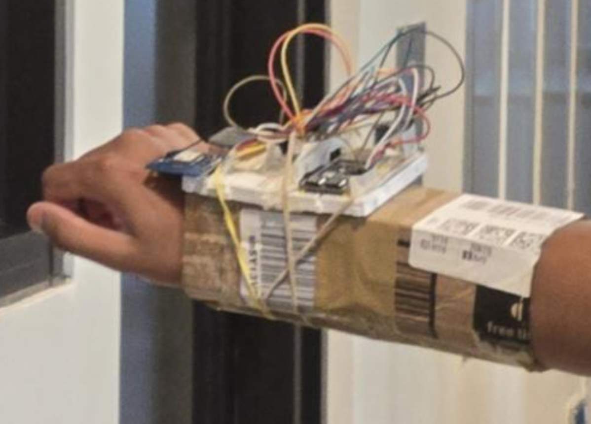
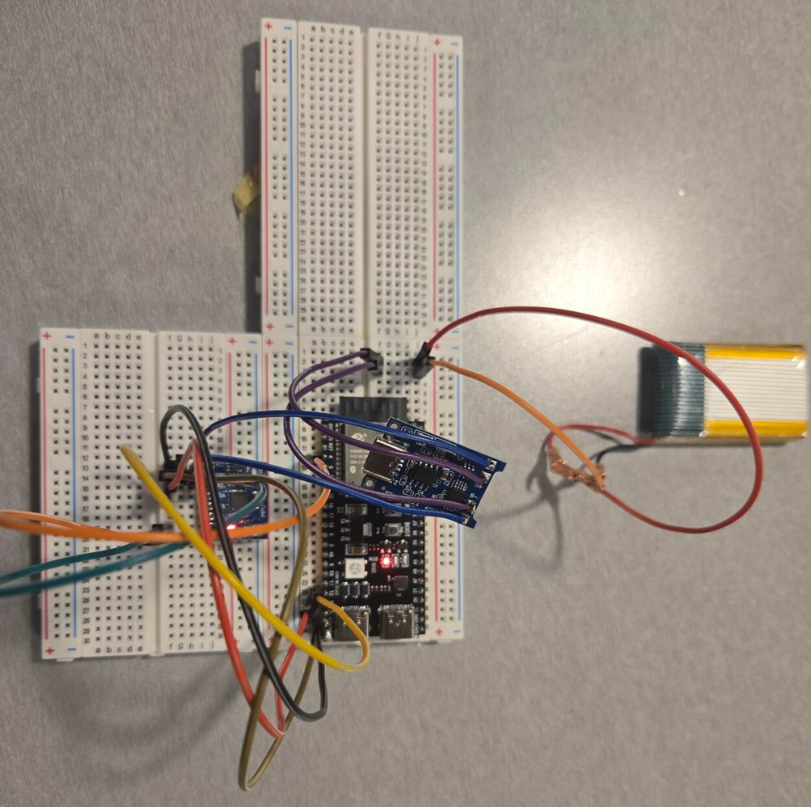
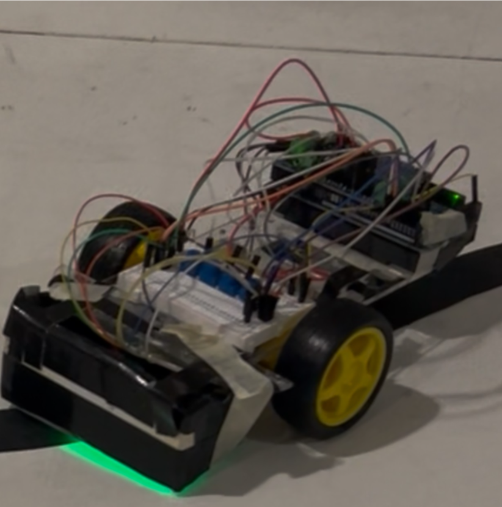
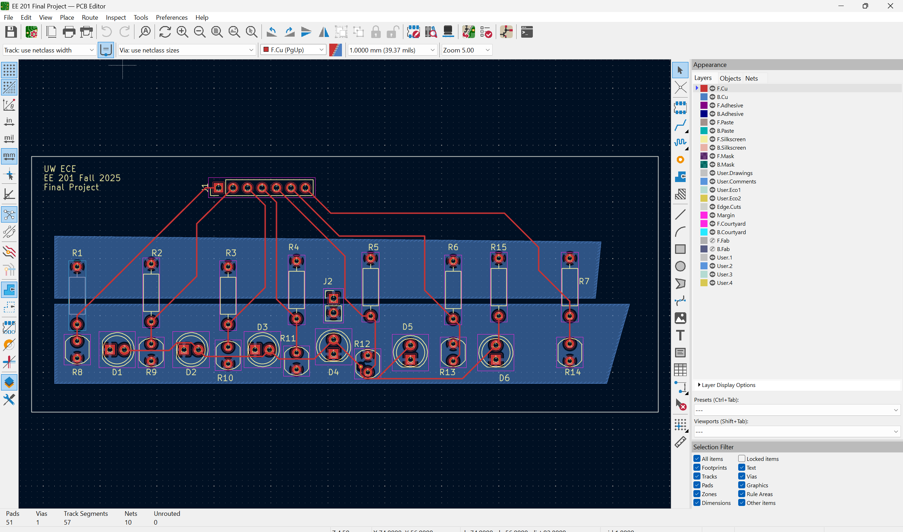
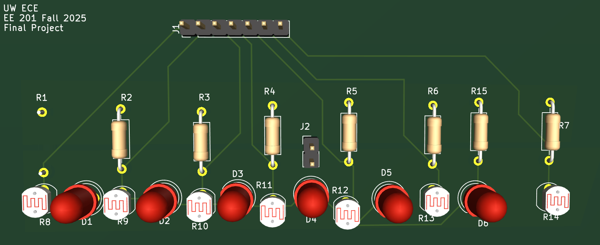

<section id="about"></section>

# <i class="fa-solid fa-address-card"></i> About

  <h4 style="margin: 0; color: #00ffcc; font-family: 'JetBrains Mono', monospace; font-size: 1.1rem;">
    Actively seeking Summer 2026 Internships
  </h4>
  

    Focus: Embedded Systems | Hardware Engineering | Robotics
  

I am an **Electrical & Computer Engineering** student at the University of Washington specializing in end-to-end embedded systems development.

* **Hardware Design:** Schematic capture and PCB layout using **Altium** and **KiCAD**.
* **Systems Engineering:** Development of wireless power modules and low-latency communication networks.
* **Firmware & Debugging:** Bridging physical sensors with software via system-level debugging and firmware development.

---

<section id="skills"></section>

# <i class="fa-solid fa-gears"></i> Skills

  

    

      <h5 style="color: #00ffcc; margin-top: 0; margin-bottom: 10px; font-size: 0.8rem; letter-spacing: 1px;">EMBEDDED & EDA</h5>
      
STM32, PSoC, ESP32-C3, Arduino, C, C++, Altium Designer, KiCAD

      
      <h5 style="color: #00ffcc; margin-top: 15px; margin-bottom: 10px; font-size: 0.8rem; letter-spacing: 1px;">CAD & DESIGN</h5>
      
Autodesk Fusion 360, AutoCAD

      
      <h5 style="color: #00ffcc; margin-top: 15px; margin-bottom: 10px; font-size: 0.8rem; letter-spacing: 1px;">SOFT SKILLS</h5>
      
Technical Documentation, Cross-functional Collaboration, Agile Methodology, Project Management, Peer Mentorship

    

    

      <h5 style="color: #00ffcc; margin-top: 0; margin-bottom: 10px; font-size: 0.8rem; letter-spacing: 1px;">TECHNICAL COMPUTING</h5>
      
Python (NumPy, pandas, Matplotlib), MATLAB, Excel, Microsoft Office, Google Workspace

      
      <h5 style="color: #00ffcc; margin-top: 15px; margin-bottom: 10px; font-size: 0.8rem; letter-spacing: 1px;">LABORATORY</h5>
      
3D Printing (Prusa, Bambu), Multimeter, Soldering, Breadboarding

    

  

---

<section id="experience"></section>

# <i class="fa-solid fa-briefcase"></i> Experience

  

    RESEARCH / EMBEDDED SYSTEMS
    JAN 2026 — PRESENT
  

  <h3 style="margin: 0; font-family: 'JetBrains Mono', monospace; color: #fff;">Programmable Matter Lab</h3>
  
Undergraduate Researcher | Seattle, WA

  <ul style="font-size: 0.9rem; line-height: 1.6;">
    <li>Digitally modeled 9 tiles to guide physical layout and mapped hardware block placement into software using measured capacitance values.</li>
    <li>Implemented a low-latency ESP32-C3 BLE Broadcasting network for real-time computer communication.</li>
    <li>Analyzed datasheets to develop electronics system including ESP32-C3, FDC2214 capacitance-to-digital converters, and multiplexers.</li>
    <li>Designed a direct-drive power system utilizing 3.2V LiFePO4 batteries to maintain a stable operating range (3.0V–3.6V).</li>
    <li>Prototyped circuits on breadboards, optimizing signal routing and stabilized capacitance readings to reduce noise by 20%.</li>
  </ul>

  

    ROBOTICS / HARDWARE DESIGN
    SEPT 2024 — PRESENT
  

  <h3 style="margin: 0; font-family: 'JetBrains Mono', monospace; color: #fff;">Husky Robotics Club</h3>
  
Electronics Engineer | Seattle, WA

  <ul style="font-size: 0.9rem; line-height: 1.6;">
    <li>Collaborated with partner to design PCBs using Altium Designer for team's mockup Mars Rover.</li>
    <li>Designed a 20A, 24V three-phase MOSFET bridge with high/low-side gate driver for a Brushless DC motor board.</li>
    <li>Replaced commercial motor controllers with a custom PCB solution, reducing system cost by 30%.</li>
    <li>Created PSoC based PCB capable of independently controlling up to 12 servo motors.</li>
    <li>Executed schematic design and PCB layout, followed by board assembly using through-hole and reflow soldering.</li>
  </ul>

  

    DATABASE / IT SUPPORT
    JUNE 2025 — SEPT 2025
  

  <h3 style="margin: 0; font-family: 'JetBrains Mono', monospace; color: #fff;">Information Management Intern</h3>
  
Intern | Seattle, WA

  <ul style="font-size: 0.9rem; line-height: 1.6;">
    <li>Managed and updated central databases using Microsoft Office and Google Workspace.</li>
    <li>Provided cross-functional technical support to assist internal team members.</li>
    <li>Collaborated with senior staff to maintain data integrity and project organization.</li>
  </ul>

  

    ROBOTICS / MECHATRONICS
    SEPT 2024 — JUNE 2025
  

  <h3 style="margin: 0; font-family: 'JetBrains Mono', monospace; color: #fff;">Human Powered Submarine Team</h3>
  
Inductive Charging Project Engineer | Seattle, WA

  

    

      
    

    

      
    

  

  <ul style="font-size: 0.9rem; line-height: 1.6;">
    <li>Engineered a wireless, submersible power module using Qi-standard inductive charging to maintain a 100% waterproof seal, eliminating the need for manual cable management.</li>
    <li>Delivered a high-capacity charging system for a 12,000 mAh Li-ion battery array (four 18650 cells), ensuring reliable power delivery for submarine electronics.</li>
    <li>Improved longevity by reducing mechanical wear on internal connectors and reducing the risk of seal failure during frequent charging cycles.</li>
  </ul>

---

<section id="projects"></section>

# <i class="fa-solid fa-microchip"></i> Projects

  

    WEARABLE TECH / EMBEDDED
    NOV 2025 — JAN 2026
  

  <h3 style="margin: 0; font-family: 'JetBrains Mono', monospace; color: #fff;">SwingTrack</h3>

  

    

      
    

    

      
    

  

  <ul style="font-size: 0.9rem; line-height: 1.6; margin-top: 15px;">
    <li>Co-developed a wearable tennis wrist device using an ESP32 dev board along with GPS and IMU sensors for real-time motion tracking and data acquisition, providing athletes with insights into swing speed (±0.2m/s) and court positioning feedback.</li>
    <li>Iterated from breadboard to a wrist-mounted form factor, optimizing hardware layout for ergonomics and reliable mobile power delivery for 4+ hours on a single charge.</li>
  </ul>

  

    ROBOTICS / PCB DESIGN
    NOV 2025 — DEC 2025
  

  <h3 style="margin: 0; font-family: 'JetBrains Mono', monospace; color: #fff;">Line-Following Robot</h3>

  

    

      
    

    

      

        
      

      

        
      

    

  

  
  <ul style="font-size: 0.9rem; line-height: 1.6; margin-top: 15px;">
    <li>Worked with a 4-person team to create a robot capable of following a 5-meter black track using Arduino, achieving >90% line-following accuracy.</li>
    <li>Independently engineered a custom KiCAD PCB with a 20+ component array of potentiometers, resistors, photoresistors and LEDs to accurately measure light reflectance values.</li>
    <li>Soldered through-hole components to a custom PCB and fabricated a light-shielding enclosure to mitigate ambient light interference.</li>
  </ul>

---

<section id="contact"></section>

# <i class="fa-solid fa-paper-plane"></i> Contact

  

    <a href="https://www.linkedin.com/in/adityamanivel" target="_blank" style="text-decoration: none; color: inherit;">
      
      LinkedIn
    </a>

    <a href="mailto:adityamanivel@gmail.com" style="text-decoration: none; color: inherit;">
      
      Email
    </a>
  

  
Located in Seattle, WA

